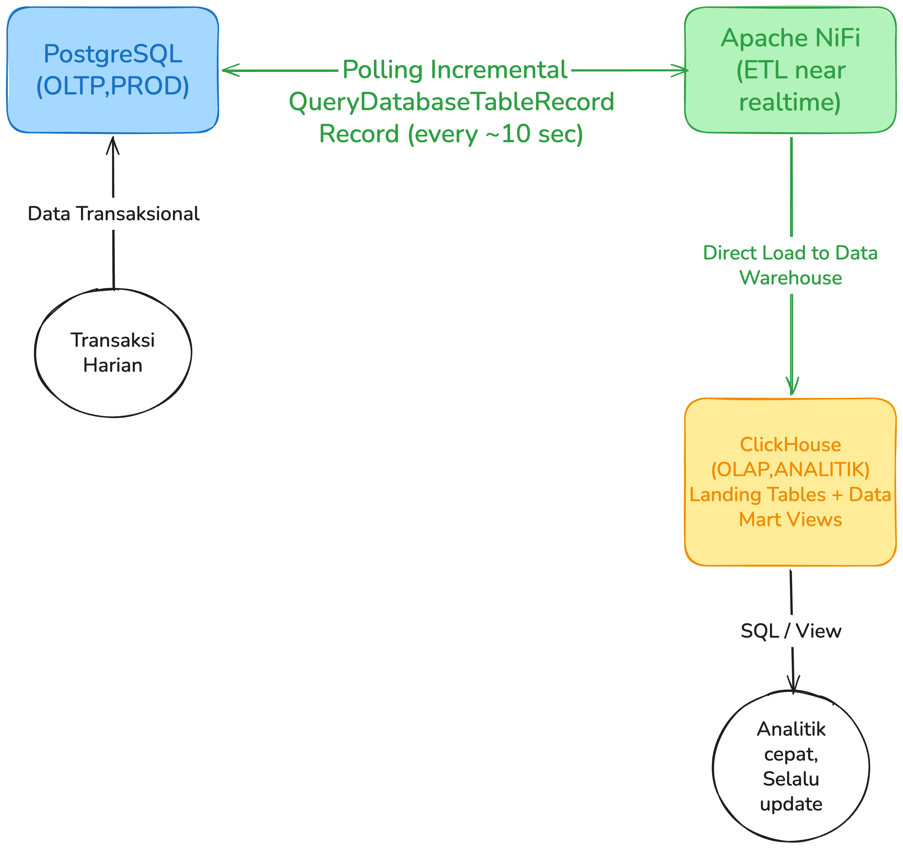
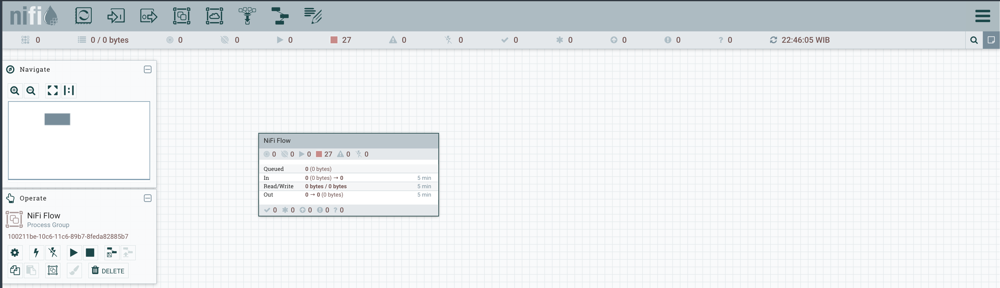
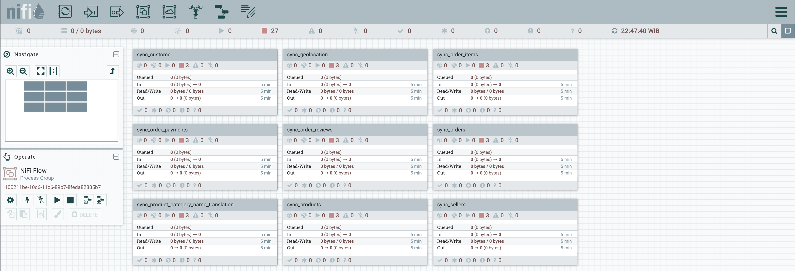
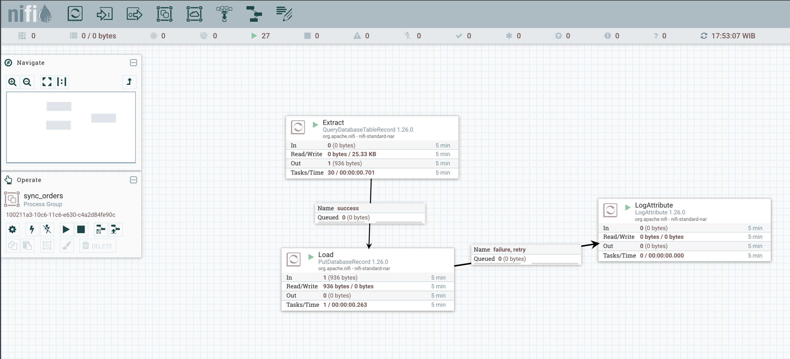
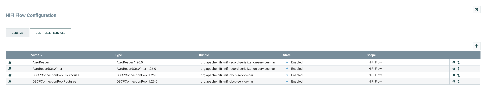
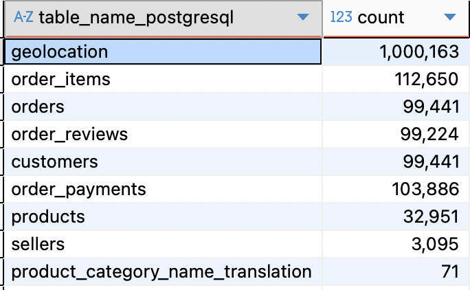
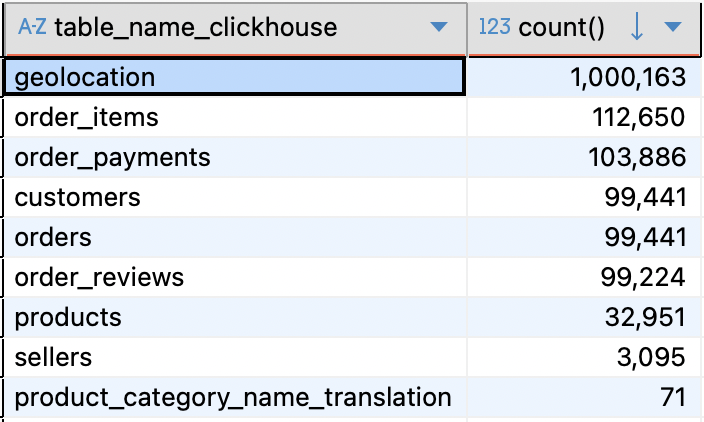
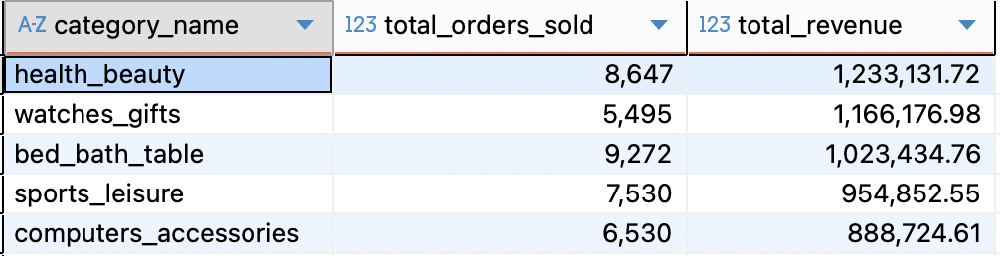
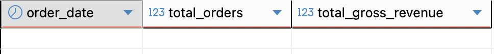
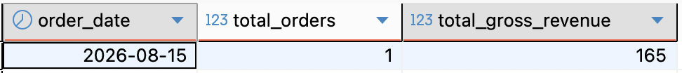

# ecommerce-nifi-pipeline

Apache NiFi ETL pipeline: data e-commerce dari **PostgreSQL (OLTP) → near-real-time streaming sync → ClickHouse (OLAP) → analitik penjualan & datamart**.

## Dataset & Source

Project ini menggunakan **[Brazilian E-Commerce Public Dataset by Olist](https://www.kaggle.com/datasets/olistbr/brazilian-ecommerce)** dari Kaggle. Dataset ini berisi ~100.000 data transaksi riil dari marketplace Olist di Brasil periode 2016-2018 yang terbagi dalam 9 tabel relasional: `orders`, `order_items`, `customers`, `products`, `sellers`, `order_payments`, `order_reviews`, `geolocation`, dan `product_category_name_translation`.

## Background Project

Pernah ngalamin tim analitik butuh 15 menit cuma buat ngeluarin report penjualan harian? Gara-gara query agregasi harus full scan puluhan juta baris di database transaksional. Masalahnya, sementara query itu jalan, aplikasi e-commerce nya jadi lemot. Checkout timeout, koneksi pool habis, customer ngeluh.

Ini bukan bug, tapi design mismatch. Database transaksional dirancang buat operasi cepat: insert order, update stock, cari data by ID. Index nya b-tree, locking nya per row, schema nya normalized. Cocok buat aplikasi yang butuh response cepat dan konsistensi transaksi.

Tapi tim analitik butuh yang beda: scan jutaan baris, agregasi per kategori/region/waktu, join beberapa tabel sekaligus. Query kayak gini bikin database transaksional kewalahan. Dan kalau dipaksa jalan bersamaan, keduanya saling ganggu.

Dulu solusinya biasa pakai export CSV manual atau ETL batch schedule harian. Tapi itu artinya data analitik selalu telat satu hari. Tim bisnis bikin keputusan pakai data kemarin, bukan kondisi real sekarang.

Project ini jadi solusi: pisahkan beban kerja dengan nge-sync data dari PostgreSQL (OLTP) ke ClickHouse (OLAP) secara near-real-time pakai Apache NiFi. Database transaksional tetep fokus handle traffic aplikasi, sementara query analitik berat dikerjain di ClickHouse yang memang didesain buat itu.

## Problem Solving

Pipeline ini memisahkan beban: **data dipindahkan dari DB prod (PostgreSQL) ke DB analitik (ClickHouse OLAP) menggunakan Apache NiFi sebagai ETL near-real-time.**



**Kenapa ClickHouse?** Database kolumnar OLAP — agregasi miliaran baris sub-sekon, kompresi tinggi, cocok untuk query analitik berat.

**Kenapa NiFi?** Visual dataflow, fault-tolerant, incremental polling otomatis (`QueryDatabaseTableRecord`), transform ringan (cast, bersihkan) sebelum sinkron ke ClickHouse. Pipeline jalan terus-menerus — data baru di Postgres → ~10 detik masuk ClickHouse.

## Work Flow

1. **Streaming sync (NiFi)** — NiFi mem-polling 9 tabel PostgreSQL tiap ~10 detik (`QueryDatabaseTableRecord`, incremental berdasarkan kolom watermark `updated_at`), ambil delta baru/berubah, tulis langsung ke tabel landing di ClickHouse (nama tabel sama: `orders`, `customers`, `order_items`, dst). Avro logical types handle timestamp, gak perlu transform manual.
2. **Datamart di ClickHouse** — query analitik berat (revenue, top kategori, top seller, kinerja per state) dibuat sebagai **VIEW** di ClickHouse yang join tabel landing. View ini selalu mengikuti data terbaru karena pipeline streaming terus update tabel landing.
3. **Result** — DB prod bebas fokus transaksi. Tim analitik query ke ClickHouse (VIEW) tanpa mengganggu operasi. Data selalu segar, tidak perlu extract manual.

## NiFi Flow Architecture

Apache NiFi mendefinisikan seluruh logika ETL secara visual sebagai **Dataflow**. Flow ini diekspor ke `flow/NiFi_Flow.json` dan dapat diimpor ke NiFi UI untuk langsung dijalankan.

### 1. Root Process Group (Canvas Utama)
Berisi 9 *Process Group* anak, masing-masing menangani sinkronisasi satu tabel PostgreSQL → ClickHouse.




**Penjelasan:**
- Masing-masing Process Group (misal `sync_orders`, `sync_customers`, `sync_order_items`, dst) bersifat **identikal struktur** namun berbeda konfigurasi nama tabel & kolom watermark.
- Semua Process Group berjalan paralel, scheduling tiap ~10 detik (`Run Schedule: 10 sec`).
- Global Controller Services: `DBCPConnectionPool_Postgres` & `DBCPConnectionPool_ClickHouse` digunakan bersama semua PG.

---

### 2. Struktur Internal Satu Process Group (Contoh: `sync_orders`)
Setiap Process Group mengandung alur standar:



**Komponen Utama:**

| Processor / Component | Fungsi |
|---|---|
| **QueryDatabaseTableRecord** | Polling inkremental ke PostgreSQL berdasarkan kolom `updated_at` (watermark). Hanya ambil baris baru/berubah sejak eksekusi terakhir. Output: Avro Record. |
| **UpdateAttribute (opsional)** | Menambahkan metadata flowfile (misal `table.name = orders`) untuk logging / routing. |
| **PutDatabaseRecord** | Menulis Avro Record ke tabel landing ClickHouse (`ecommerce.orders`). Menggunakan `DBCPConnectionPool_ClickHouse`. Batch insert otomatis. |
| **LogAttribute (success/failure)** | Logging throughput & error handling. |

**Koneksi Relationship:**
- `success` → `PutDatabaseRecord` → `LogAttribute` (success)
- `retry` / `failure` → `LogAttribute` (error) → (opsional) `RetryFlowFile` dengan backoff

---

### 3. Konfigurasi Kunci (Key Settings)

#### QueryDatabaseTableRecord
| Property | Value / Penjelasan |
|---|---|
| Database Connection Pooling Service | `DBCPConnectionPool_Postgres` |
| Table Name | `public.orders` (per PG masing-masing) |
| Maximum Value Columns | `updated_at` (kolom watermark incremental) |
| Output Format | `Avro` (dengan **Use Avro Logical Types = true** untuk timestamp/decimal) |
| Run Schedule | `10 sec` |

#### PutDatabaseRecord
| Property | Value / Penjelasan |
|---|---|
| Database Connection Pooling Service | `DBCPConnectionPool_ClickHouse` |
| Table Name | `ecommerce.orders` (nama tabel di ClickHouse) |
| Statement Type | `INSERT` |
| Translate Field Names | `true` (mapping Avro schema → ClickHouse columns) |
| Unmatched Field Behavior | `Ignore` |
| Unmatched Column Behavior | `Ignore` |

---

### 4. Controller Services (Shared)



- **DBCPConnectionPool_Postgres**: Connection pool JDBC untuk PostgreSQL (`jdbc:postgresql://postgres:5432/olist`, driver `postgresql-42.7.3.jar`).
- **DBCPConnectionPool_ClickHouse**: Connection pool JDBC untuk ClickHouse (`jdbc:clickhouse://clickhouse:8123/ecommerce`, driver `clickhouse-jdbc-0.6.0.jar`).
- **AvroReader**: Controller service untuk membaca (parse) data berformat Avro yang diterima dari FlowFile. Menggunakan skema Avro bawaan (embedded) dalam payload agar `PutDatabaseRecord` dapat memetakan kolom secara otomatis.
- **AvroRecordSetWriter**: Controller service untuk menulis hasil query dari `QueryDatabaseTableRecord` ke format Avro. Konfigurasi kunci: `Use Avro Logical Types = true` agar tipe data presisi seperti `timestamp`, `date`, dan `decimal` dipertahankan dalam format aslinya (bukan string).

---

### 5. Monitoring & Troubleshooting
- **Bulletins**: Klik ikon peringatan di processor untuk lihat error detail.
- **Data Provenance**: Track lineage flowfile dari PG → CH.
- **Backpressure**: Threshold default 10,000 flowfile / 1 GB — naikkan jika volume spike.

---

## Result

### 1. Data Verification: Source → NiFi Flow → Destination → Datamart

Untuk memastikan konsistensi data, dilakukan verifikasi jumlah baris (row count) antara database transaksional PostgreSQL (Source) dengan database analitik ClickHouse (Destination).

#### A. Row Count Verification
Query verifikasi dijalankan di kedua database untuk memastikan data tersinkronisasi 100%:

```sql
-- PostgreSQL (Source)
SELECT 'orders' AS table_name, count(*) FROM public.orders
UNION ALL SELECT 'customers', count(*) FROM public.customers
UNION ALL SELECT 'order_items', count(*) FROM public.order_items
UNION ALL SELECT 'order_payments', count(*) FROM public.order_payments
UNION ALL SELECT 'order_reviews', count(*) FROM public.order_reviews
UNION ALL SELECT 'products', count(*) FROM public.products
UNION ALL SELECT 'sellers', count(*) FROM public.sellers
UNION ALL SELECT 'geolocation', count(*) FROM public.geolocation
UNION ALL SELECT 'product_category_name_translation', count(*) FROM public.product_category_name_translation;

-- Clickhouse (Destination)
SELECT 'orders' AS table_name_clickhouse, count(*) FROM orders
UNION ALL SELECT 'customers', count(*) FROM customers
UNION ALL SELECT 'order_items', count(*) FROM order_items
UNION ALL SELECT 'order_payments', count(*) FROM order_payments
UNION ALL SELECT 'order_reviews', count(*) FROM order_reviews
UNION ALL SELECT 'products', count(*) FROM products
UNION ALL SELECT 'sellers', count(*) FROM sellers
UNION ALL SELECT 'geolocation', count(*) FROM geolocation
UNION ALL SELECT 'product_category_name_translation', count(*) FROM product_category_name_translation;
```
Postgresql (Source)


Clickhouse (Destination)


Hasil perbandingan data:

| Nama Tabel | PostgreSQL (Source) | ClickHouse (Destination) | Status Sync |
|---|---|---|---|
| `orders` | 99,441 | 99,441 | Match (100%) |
| `customers` | 99,441 | 99,441 | Match (100%) |
| `order_items` | 112,650 | 112,650 | Match (100%) |
| `order_payments` | 103,886 | 103,886 | Match (100%) |
| `order_reviews` | 99,224 | 99,224 | Match (100%) |
| `products` | 32,951 | 32,951 | Match (100%) |
| `sellers` | 3,095 | 3,095 | Match (100%) |
| `geolocation` | 1,000,163 | 1,000,163 | Match (100%) |
| `product_category_name_translation` | 71 | 71 | Match (100%) |

#### B. Datamart View Result (ClickHouse)
Setelah data landing di ClickHouse, query analitik dijalankan melalui View Datamart (`sql/clickhouse/02_datamart_views.sql`).

**Contoh Query: Top 5 Kategori Produk Berdasarkan Revenue**
```sql
SELECT category_name, total_orders_sold, total_revenue
FROM ecommerce.view_top_product_categories
LIMIT 5;
```

*Output:*


| category_name | total_orders_sold | total_revenue |
|---|---|---|
| `health_beauty` | 8,647 | R$ 1,233,131.72 |
| `watches_gifts` | 5,495 | R$ 1,166,176.98 |
| `bed_bath_table` | 9,272 | R$ 1,023,434.76 |
| `sports_leisure` | 7,530 | R$ 954,852.55 |
| `computers_accessories` | 6,530 | R$ 888,724.61 |

---

### 2. Proof of Near-Real-Time Incremental Sync

Bagian ini membuktikan bahwa Apache NiFi secara aktif mendeteksi perubahan data baru di PostgreSQL dan melakukan update ke ClickHouse secara near-real-time.

#### Step 1: Query Baseline di Datamart View ClickHouse (Sebelum Update)
Cek total penjualan untuk tanggal (`2026-08-15`):

```sql
SELECT order_date, total_orders, total_gross_revenue
FROM ecommerce.view_daily_sales_performance
WHERE order_date = '2026-08-15';
```


*Output:* `0 rows` (belum ada transaksi untuk tanggal ini).

#### Step 2: Inject Transaksi Baru di PostgreSQL (Source)
Dijalankan DML insert transaksi baru pada PostgreSQL:

```sql
INSERT INTO public.customers (customer_id, customer_unique_id, customer_zip_code_prefix, customer_city, customer_state)
VALUES ('c_stream_999', 'cu_stream_999', '01001', 'sao paulo', 'SP');

INSERT INTO public.orders (order_id, customer_id, order_status, order_purchase_timestamp)
VALUES ('o_stream_999', 'c_stream_999', 'delivered', NOW());

INSERT INTO public.order_items (order_id, order_item_id, product_id, seller_id, price, freight_value)
VALUES ('o_stream_999', 1, 'prod_test_001', 'seller_test_001', 150.00, 15.00);
```
*(Trigger `trg_*_updated_at` di PostgreSQL otomatis mengisi kolom `updated_at = NOW()`)*.

#### Step 3: Proses Delta Detection di Apache NiFi
1. Processor `QueryDatabaseTableRecord` mem-polling PostgreSQL setiap ~10 detik.
2. NiFi mendeteksi baris baru dengan watermark `updated_at > last_watermark`.
3. Data diekstrak dan dikirim via `PutDatabaseRecord` ke ClickHouse landing table `ecommerce.orders` dan `ecommerce.order_items`.

example-flow:


#### Step 4: Re-query Datamart View di ClickHouse (Destination)
Tunggu ~10 detik, lalu jalankan kembali query di ClickHouse:

```sql
SELECT order_date, total_orders, total_gross_revenue
FROM ecommerce.view_daily_sales_performance
WHERE order_date = '2026-08-15';
```


*Output (Sesudah Sync):*
| order_date | total_orders | total_gross_revenue |
|---|---|---|
| `2026-08-15` | **1** | **R$ 165.00** |

**Kesimpulan:** Data transaksi baru di PostgreSQL otomatis terdeteksi, di-sync ke ClickHouse landing table, dan langsung terefleksi pada Datamart View dalam waktu **< 10 detik** tanpa perlu re-run ETL manual.

## Folder Structure

```
ecommerce-nifi-pipeline/
├── docker-compose.yml        # NiFi, PostgreSQL, ClickHouse (stateful di named volumes Docker)
├── .env.example              # template credentials (copy ke .env, jangan commit .env)
├── .gitignore
├── Dockerfile                # custom NiFi image dengan JDBC drivers
├── README.md
├── extensions/               # JDBC drivers untuk NiFi (di-copy ke container via Dockerfile)
│   ├── clickhouse-jdbc-0.6.0.jar
│   └── postgresql-42.7.3.jar
├── flow/                     # definisi flow NiFi (export dari UI, importable)
│   └── NiFi_Flow.json        # full export flow
├── sql/
│   ├── postgres/             # (referensi) DDL source Olist — dibuat manual via DBeaver
│   │   └── 01_raw_tables.sql
│   └── clickhouse/           # DDL landing tables & datamart views
│       ├── 01_raw_tables.sql
│       └── 02_datamart_views.sql
└── .ignored/                 # file kerja lokal (spec/plan skill) — gitignored
```

---

## Handling Data Updates & Known Limitations

Arsitektur pipeline saat ini menggunakan pendekatan **INSERT-only** ke ClickHouse `MergeTree`. Hal ini memiliki konsekuensi: saat terjadi `UPDATE` di PostgreSQL, data baru di-INSERT ke ClickHouse sehingga terjadi duplikat Primary Key. Bagian ini menjelaskan cara mengatasi hal tersebut beserta trade-off arsitektural.

### 1. Mengubah Engine ke `ReplacingMergeTree`

Ganti engine tabel dari `MergeTree` → `ReplacingMergeTree` dengan kolom versi (`updated_at`) sebagai tie-breaker.

**Sebelum:**
```sql
CREATE TABLE ecommerce.orders (...) ENGINE = MergeTree ORDER BY (order_id);
```

**Sesudah:**
```sql
CREATE TABLE ecommerce.orders (...) 
ENGINE = ReplacingMergeTree(updated_at) 
ORDER BY (order_id);
```

**Cara kerja:**
- Saat background merge, ClickHouse menghapus duplikat PK, menyimpan row dengan `updated_at` **tertinggi**.
- Harus diterapkan ke **semua 9 landing tables** di `sql/clickhouse/01_raw_tables.sql`.

### 2. Menggunakan Modifier `FINAL` di Query / View

Agar query selalu mengembalikan data terbaru (tanpa menunggu background merge), tambahkan keyword `FINAL`.

**Contoh pada View Datamart:**
```sql
-- Sebelum
SELECT * FROM ecommerce.orders WHERE order_status = 'delivered';

-- Sesudah (strong consistency)
SELECT * FROM ecommerce.orders FINAL WHERE order_status = 'delivered';
```

**Dampak Performa:**
- `FINAL` memaksa merge on-the-fly saat query dieksekusi → **lebih lambat** (khususnya tabel besar).
- Gunakan `FINAL` di **View Datamart** (analitik) untuk akurasi; hindari di query high-throughput/low-latency.

### 3. Otomatisasi Merge dengan `OPTIMIZE TABLE` (Orkestrasi)

Background merge ClickHouse bersifat **asynchronous & non-deterministic**. Untuk memaksa deduplikasi tepat waktu (misal setiap 5 menit / setelah batch NiFi), gunakan perintah `OPTIMIZE` via orkestrasi.

**Query Manual:**
```sql
OPTIMIZE TABLE ecommerce.orders FINAL DEDUPLICATE;
```

**Opsi Orkestrasi (Konseptual):**

| Tool | Pendekatan |
|---|---|
| **Apache Airflow** | `ClickHouseOperator` task menjalankan `OPTIMIZE ... FINAL DEDUPLICATE` setiap 5 menit / di-trigger sensor setelah NiFi selesai. |
| **Kestra** | Flow dengan `ClickHouse` task atau `Script` task eksekusi optimize command, terjadwal atau event-driven. |

**Catatan:** `OPTIMIZE ... FINAL` rewrite part — berat pada tabel besar (>100M rows). Sesuaikan frekuensi dengan volume data.

### 4. Known Limitations & Trade-offs

| Aspek | Status | Catatan |
|---|---|---|
| **INSERT** | Supported | Data baru tersedia ~10 detik. |
| **UPDATE** | Eventual Consistency | Via `ReplacingMergeTree` + `FINAL` / `OPTIMIZE`. Tanpa `FINAL`, duplikat mungkin muncul sampai merge jalan. |
| **DELETE** | **Tidak Didukung** | `QueryDatabaseTableRecord` hanya tangkap INSERT/UPDATE via watermark. Row terhapus di PG **tetap ada** di ClickHouse (no tombstone, no CDC). |
| **Schema Evolution** | Manual | Tambah kolom di PG → butuh `ALTER TABLE` di CH, update NiFi flow, redeploy. |
| **Backfill / Re-sync** | Manual | Butuh reset watermark NiFi, `TRUNCATE` landing table CH, re-run flow. |
| **Latency** | ~10 detik (INSERT) | Konsistensi UPDATE bergantung interval merge / `OPTIMIZE`. |

> **Catatan:** Desain saat ini sengaja **ringan, minimal dependensi** untuk near-real-time analytics. Trade-off di atas acceptable untuk banyak use case analitik di mana eventual consistency pada UPDATE tolerable dan DELETE jarang/ditangani via soft-delete flag di source.